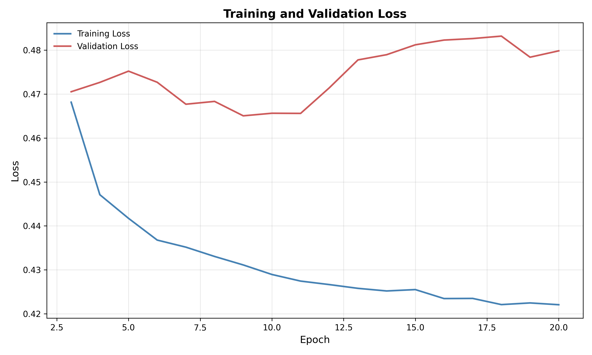

# 2D Improved U-Net for Prostate MRI Segmentation
Student Number: 47205145 \
Name: Neil Barigye

## Overview
This project implements an Improved U-Net for 2D segmentation of the HipMRI Prostate Cancer dataset, which corresponds to Project 3 (Normal Difficulty).  
The model enhances the original U-Net architecture by incorporating residual connections, spatial and channel squeeze-and-excitation (scSE) modules, and attention gates to improve feature representation and segmentation accuracy.  

## Algorithm Description

### Model
The Improved U-Net builds upon the standard U-Net by adding architectural improvements for better gradient flow, attention, and feature recalibration:
- Residual Blocks for enhanced gradient propagation and stable training.  
- Spatial and Channel Squeeze-and-Excitation (scSE) Blocks to adaptively emphasise informative features.  
- Attention Gates to suppress irrelevant features from encoder layers before concatenation.  
- Deep Supervision via auxiliary outputs that stabilise learning during early epochs.  

The model is implemented in `modules.py` under the class `ImprovedUNet`.

### Data
The model is trained on 2D MRI slices and corresponding segmentation masks from the HipMRI Study on Prostate Cancer.  
Preprocessing and loading are handled in `dataset.py`:
- Images and masks are read from `.nii` or `.nii.gz` files using NiBabel.  
- Images are standardised and resized to 256×128.  
- Data is returned as tensors compatible with PyTorch.  

## Training

Training is managed through `train.py`, which defines the learning process, loss functions, and evaluation metrics.

Key components:
- Loss Function: `ComboLoss`, combining `Generalised Dice Loss` and `Cross-Entropy Loss` to handle class imbalance and overlap accuracy.  
- Optimiser: `AdamW` with cosine annealing learning rate scheduling.  
- Mixed Precision Training: enabled when using CUDA for efficiency.  
- Regularisation: dropout and gradient clipping (max norm 1.0).  
- Deep Supervision: auxiliary losses from intermediate decoder layers.  

Training parameters:
- Batch size: 32  
- Epochs: 25  
- Learning rate: 3e-3  
- Weight decay: 1e-2  
- Base channels: 64  
- Dropout: 0.1  

Training and validation losses are plotted over epochs and saved as:

<!--  -->
[INSERT IMAGE HERE]

## Evaluation

Evaluation is performed using `predict.py`.  
The model's predictions are compared to ground truth labels using `Dice similarity coefficients`.  
The script also produces visual comparisons between input images, true masks, and predicted masks.

### Results
The model achieved strong segmentation performance across all classes, indicating robust generalisation to unseen slices.

<!--  -->
[INSERT IMAGE HERE]
