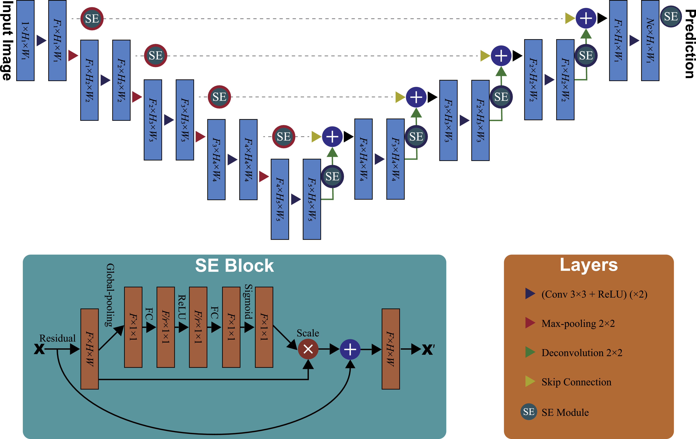
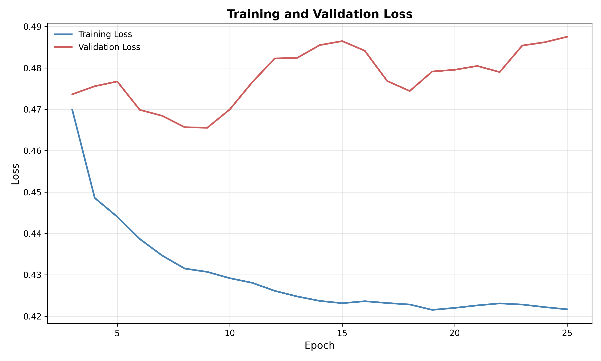
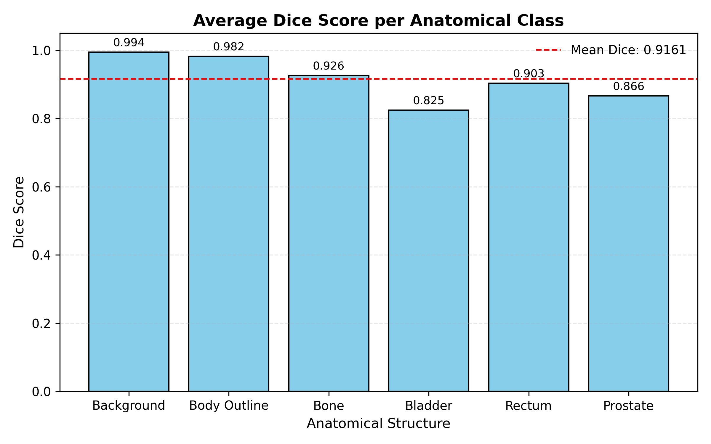
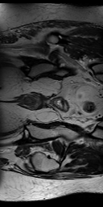
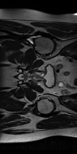
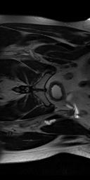

# 2D Improved U-Net for Prostate MRI Segmentation
Student Number: 47205145 \
Name: Neil Barigye

## Overview
This project implements an Improved U-Net for 2D segmentation of the HipMRI Prostate Cancer dataset, which corresponds to Project 3 (Normal Difficulty).  
The goal is to segment the prostate and surrounding organs (body outline, bone, bladder, rectum, and prostate) from MRI slices to support radiotherapy treatment planning and anatomical analysis.

The model enhances the original U-Net architecture by incorporating residual connections, spatial and channel squeeze-and-excitation (scSE) modules, and attention gates to improve feature representation and segmentation accuracy.  


## Algorithm Description

### Model

The Improved U-Net (pictured below) builds upon the original U-Net architecture, which was designed for biomedical image segmentation. While the traditional U-Net is powerful and efficient, several architectural refinements have been developed to address its limitations in gradient flow, feature discrimination, and contextual awareness.



The Improved U-Net integrates several mechanisms that enhance learning stability, feature selectivity, and representational capacity:

#### Residual Blocks
Instead of plain convolutional pairs, each block includes a residual shortcut that adds the input to the output of two convolutional layers.

This modification: 
- Promotes gradient flow during backpropagation, reducing vanishing gradient issues. 
- Enables deeper architectures without degrading training stability. 
- Encourages feature reuse, allowing the network to learn more efficiently. 
- Residual learning ensures the network focuses on learning residual mappings rather than direct transformations, improving convergence. 

#### Spatial and Channel Squeeze-and-Excitation Blocks
The scSE mechanism combines two complementary forms of attention: 
- Channel Squeeze-and-Excitation (cSE): Learns to reweight feature channels based on global context, emphasising the most informative filters. 
- Spatial Squeeze-and-Excitation (sSE): Learns spatial masks to highlight important regions within feature maps. 

Together, they improve feature recalibration by focussing the model only on relevant anatomical structures and suppressing background noise. 

#### Attention Gates
Attention gates are applied to skip connections before feature concatenation in the decoder. They learn to selectively pass information from the encoder, conditioning it on the decoder’s current context. 

This ensures: 
- Only relevant encoder features are merged, preventing irrelevant background activations from propagating. 
- Enhanced localisation accuracy near structure boundaries. 

This mechanism is inspired by the Attention U-Net model and improves segmentation quality in complex or low-contrast regions.

The model is implemented in `modules.py` under the class `ImprovedUNet`.

### Data
The model is trained on 2D MRI slices and corresponding segmentation masks from the HipMRI Study on Prostate Cancer.  

#### Preprocessing
Preprocessing and loading are handled in `dataset.py`:
- Images and masks are read from `.nii` or `.nii.gz` files using NiBabel.  
- Images are standardised and resized to `256×128`.  
- Data is returned as tensors compatible with PyTorch.  

#### Data splits:

- `train.py` uses `keras_slices_train` and `keras_slices_seg_train` for training.
- `keras_slices_test` and `keras_slices_seg_test` are used for validation.
- `predict.py` uses the `keras_slices_validate set` for evaluation and visualisation.
These splits follow the official (given) HipMRI dataset partitions to ensure reproducibility and fair comparison.

## Training

Training is managed through `train.py`, which defines the learning process, loss functions, and evaluation metrics.

Key components:
- Loss Function: `ComboLoss`, combining `Generalised Dice Loss` and `Cross-Entropy Loss` to handle class imbalance and overlap accuracy.  
- Optimiser: `AdamW` with cosine annealing learning rate scheduling.  
- Mixed Precision Training: enabled when using CUDA for efficiency.  
- Regularisation: dropout and gradient clipping (max norm 1.0).  
- Deep Supervision: auxiliary losses from intermediate decoder layers.  

Training parameters:
- Batch size: 32  
- Epochs: 25  
- Learning rate: 3e-3  
- Weight decay: 1e-2  
- Base channels: 64  
- Dropout: 0.1  

Training and validation losses are plotted over epochs and saved as:



Command to train (assuming your terminal is positioned at `/2D_Improved_UNET_47205145/`, which is also assumed to contain HipMRI_Study_open):
```bash
python train.py
```

## Evaluation

Evaluation is performed using `predict.py`.  
The model's predictions are compared to ground truth labels using `Dice similarity coefficients`.  
The script also produces visual comparisons between input images, true masks, and predicted masks.

### Results
The Improved U-Net achieved robust segmentation performance across all anatomical classes, showing effective localisation of the prostate and surrounding organs.
Quantitatively, average Dice scores across classes were in the range of 0.825-0.994, with the bladder and background being the least and most accurately predicted classes respectively.
These results demonstrate that the architectural improvements enhance feature learning and generalisation to unseen slices.



Command to evaluate (assuming your terminal is positioned at /2D_Improved_UNET_47205145/, which is also assumed to contain HipMRI_Study_open):
```bash
python predict.py
```

## Visual Results

Below are some example qualitative results on validation data:

| Original | Ground Truth | Prediction |
|:--:|:--:|:--:|
|  |  |  |
|  |  |  |
|  |  |  |

## Dependencies

| Package | Version | Purpose |
|----------|----------|----------|
| **Python** | ≥3.9 | Core language |
| **PyTorch** | ≥2.1 | Deep learning framework |
| **Torchvision** | ≥0.16 | Optional utilities for PyTorch models |
| **NumPy** | ≥1.24 | Array manipulation and numerical operations |
| **NiBabel** | ≥5.0 | Loading and handling medical NIfTI (.nii/.nii.gz) files |
| **Matplotlib** | ≥3.8 | Plotting training curves and visualising results |
| **tqdm** | ≥4.66 | Optional (for progress bars during data loading or training) |

To install all required packages:
```bash
pip install torch torchvision nibabel numpy matplotlib tqdm
```

## References
F. Isensee, P. Kickingereder, W. Wick, M. Bendszus, and K. H. Maier-Hein, “Brain Tumor Segmentation and Radiomics Survival Prediction: Contribution to the BRATS 2017 Challenge,” Feb. 28, 2018, arXiv: arXiv:1802.10508. doi: 10.48550/arXiv.1802.10508. \
L. Rundo et al., “USE-Net: Incorporating Squeeze-and-Excitation blocks into U-Net for prostate zonal segmentation of multi-institutional MRI datasets,” Neurocomputing, vol. 365, pp. 31–43, Nov. 2019, doi: 10.1016/j.neucom.2019.07.006. \
O. Ronneberger, P. Fischer, and T. Brox, “U-Net: Convolutional Networks for Biomedical Image Segmentation,” May 18, 2015, arXiv: arXiv:1505.04597. doi: 10.48550/arXiv.1505.04597. \
O. Oktay et al., “Attention U-Net: Learning Where to Look for the Pancreas,” May 20, 2018, arXiv: arXiv:1804.03999. doi: 10.48550/arXiv.1804.03999. \
Y. Zhao, H. Yang, H. Yan, S. Shen, D. Cai, and X. Lyu, “Benggang Extraction Based on Improved U-Net Model from Satellite Remote Sensing Images,” in 2023 4th International Conference on Computer Vision, Image and Deep Learning (CVIDL), May 2023, pp. 170–174. doi: 10.1109/CVIDL58838.2023.10167177. 